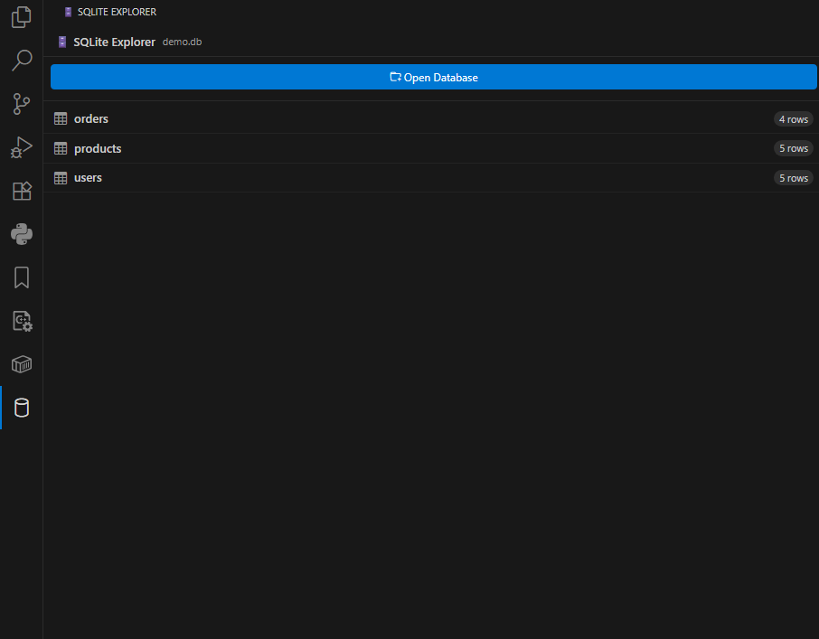
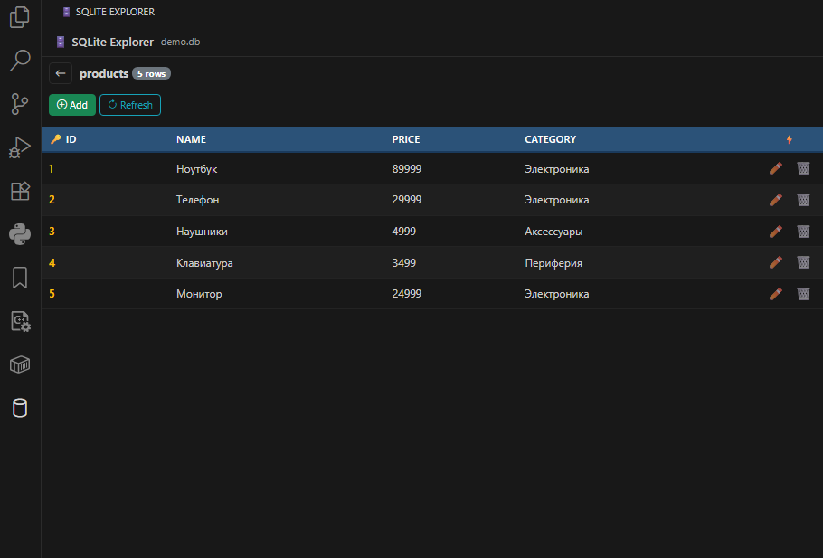
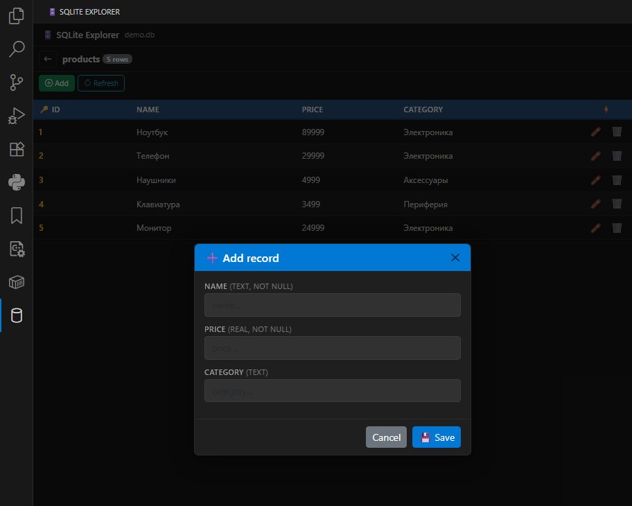

# SQLite Explorer Plus for VS Code

A lightweight SQLite database viewer **and editor** for VS Code, inspired by phpMyAdmin and DB Browser for SQLite.

Just click on any `.db`, `.sqlite`, or `.sqlite3` file — browse tables, add, edit, and delete records right from the sidebar.

## Features

- **Full CRUD** — Create, Read, Update, and Delete records directly in VS Code
- **Auto-generated forms** — Insert/edit forms are built automatically from table column definitions
- **File extension association** — Just click on a `.db` file and the sidebar panel opens instantly
- **Platform-independent** — No native dependencies, powered by sql.js (WebAssembly)
- **Seamlessly integrates with VS Code** — Matches your light or dark color theme
- **phpMyAdmin-style data grid** — Familiar table layout with primary key highlighting
- **Delete confirmation** — No accidental deletions, every delete requires confirmation
- **Keyboard shortcuts** — `Enter` to save, `Escape` to cancel

## Screenshots

### Browse Tables
View all tables in your database with row counts at a glance.

### View & Edit Data
phpMyAdmin-style data grid with inline edit and delete buttons.

### Auto-Generated Forms
Add or edit records with forms built automatically from table columns.

## How It Works

1. Click the 🗄️ icon in the Activity Bar, or right-click any `.db` file → **"Open in SQLite Explorer Plus"**
2. Browse your tables with row counts
3. Click a table to view its data
4. Use ➕ **Add**, ✏️ **Edit**, 🗑️ **Delete**, 🔄 **Refresh**

## License

MIT
